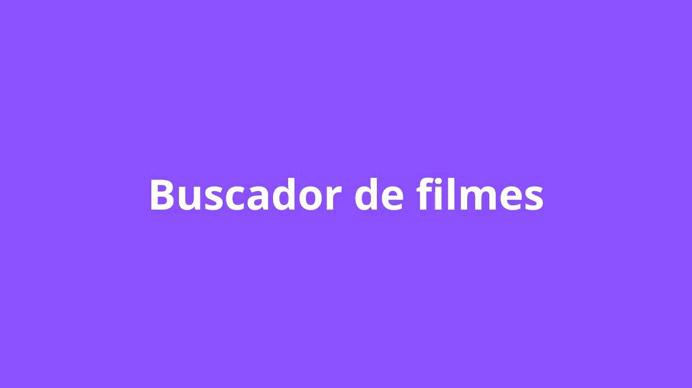

<h1>Projeto: Buscador de Filmes</h1>

<h2>Descrição do projeto</h2>

O app consiste em fazer uma consulta online sobre filmes e seus detalhes.

<h2>Funcionalidades do projeto</h2>

A funcionalidade consiste em informar o usuário sobre dados de um filme como custo, bilheteria, etc.

<h2>Tecnologias utilizadas</h2>

<ul>
    <li>Dart</li>
    <li>Flutter</li>
    <li>IDE utilizada: Android Studio</li>
</ul>

<h2>Testar localmente</h2>

1 - No terminal do Android Studio (ou na IDE que você estiver utilizando), navegue através de comandos para o local que deseja salvar o projeto clonado. Mesmo que você esteja com um projeto aberto, é possível navegar pelo terminal da sua IDE e salvar em um outro local. Também é possível fazer isso no terminal do seu sistema operacional.

  

2 - Utilize o comando <code>git clone https://github.com/victoramos1/buscador-filmes-flutter</code> caso tenha o Git instalado no computador, ou faça o download do arquivo .zip diretamente do GitHub e descompacte em um local.

3 - Gere uma chave para API do The Movie DataBase (TMDB) conforme o link <code>https://developers.themoviedb.org/3/getting-started/introduction</code> e armazene para usar no passo seguinte.</p3>

4- Com o projeto aberto dentro da sua IDE, cole a sua API Key no código dentro dos arquivos detalhes.dart, paginaInicial.dart e resultadoBusca.dart dentro das aspas em <code>String = apiKey=""</code>. Terá uma instrução dentro do código para auxílio.

5 - Com o projeto aberto e com o endereço do terminal da IDE indicando onde está seu projeto, execute o comando <code>flutter pub get</code> para baixar dependências

6 - Com o projeto aberto no Android Studio (ou outra IDE), dê play no arquivo main.dart no emulador virtual ou celular físico

<h2>Status do projeto</h2>

Versão 1.0.0 finalizada.

